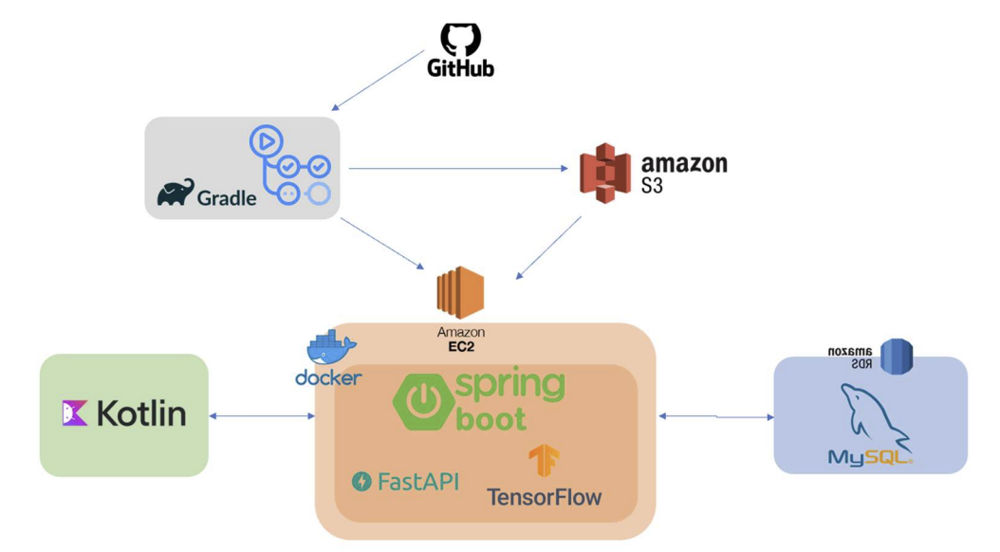

# BackEnd repo

## main 브랜치 :

최종 프로덕트 용 브랜치(배포용), 최대한 완벽한 것만 올리는 브랜치로 2주 간격으로 올릴 예정

## develop 브랜치 :

개발자가 자유롭게 개발하는 브랜치(테스트), 실직적으로 개인이 개발한 후 Push후 Pull Requests 하는 공간

-----
# git 협업 규칙

## main 브랜치 규칙

<aside>
💡
main 브랜치는 함부로 접근 및 Push 할 수 없고 PR할 경우 2명에게 승인을 받아야 한다.

</aside>

## develop 브랜치 규칙

<aside>

develop 브랜치는 PR할 경우 2명에게 승인을 받아야 한다. 개인 브랜치에서 작업 하고 해당 담당자가 PR

</aside>

## 기능 추가 메뉴얼

1. 이슈 생성
2. 로컬에서 기능에 대한 브랜치 생성 ex) 브랜치 이름 : feature/(기능이름)

-------

# 아키텍처

## 개요
사용자의 기본 정보(성별, 나이대, 선호 장르, 분위기)와
실시간 평가 데이터를 기반으로 개인화된 영화 추천을 제공하는 소프트웨어를 개발한다.  

추천 대상 영화들의 리뷰 데이터를 AI 감성 분석하여 긍정적 평가를 받은 영화 위주로 최종 추천 결과를 제공하며, 
사용자의 평가(좋아요/ 싫어요)를 반영해 추천 품질을 점진적으로 향상시키는 시스템을 구축한다.

